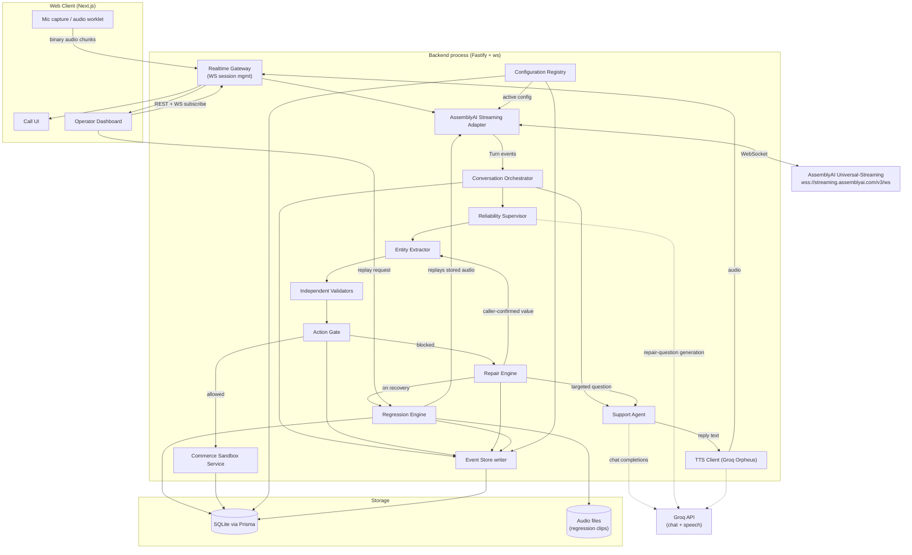
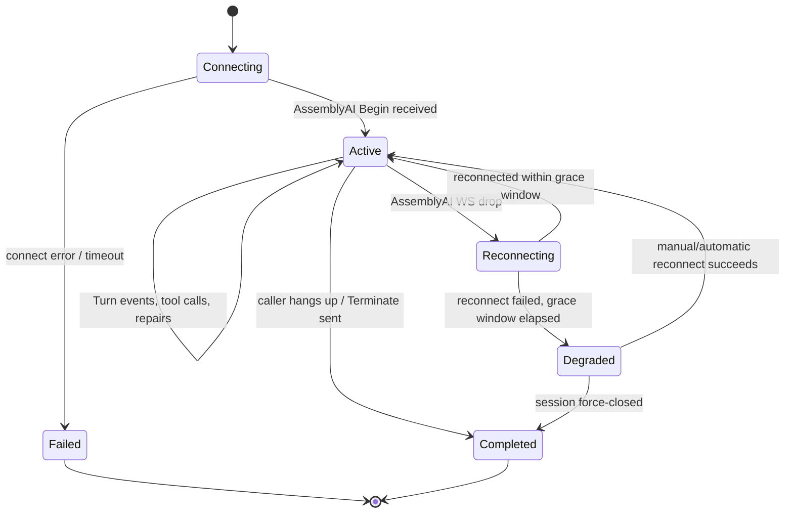
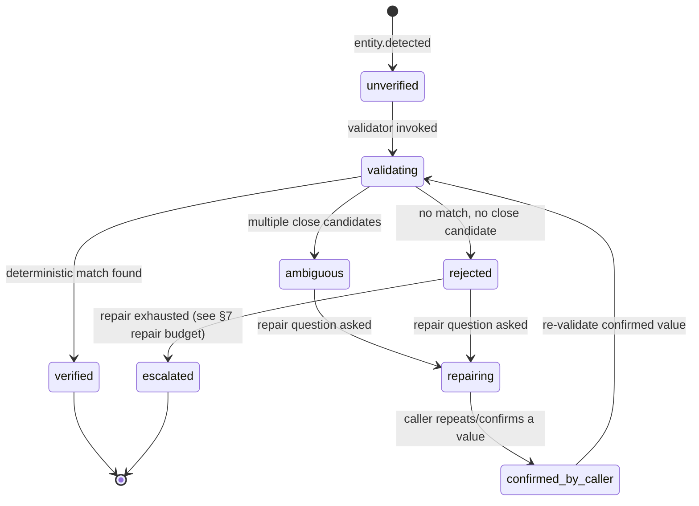
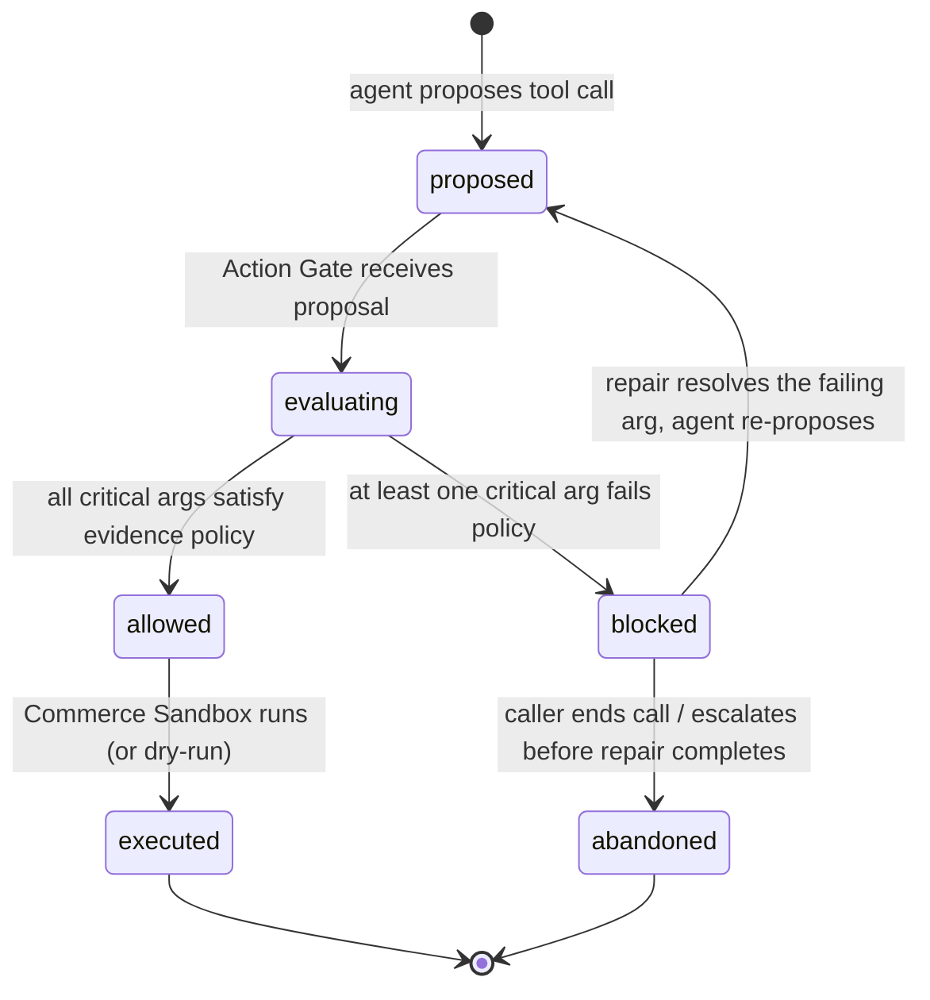
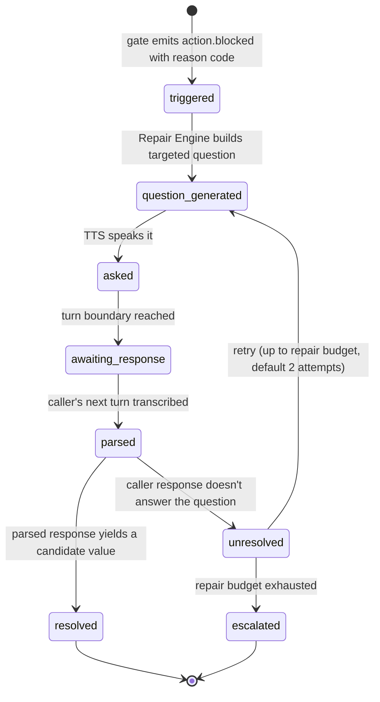
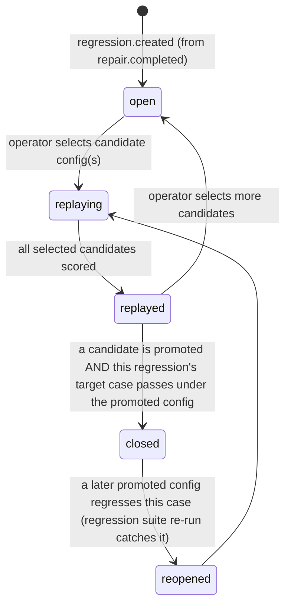
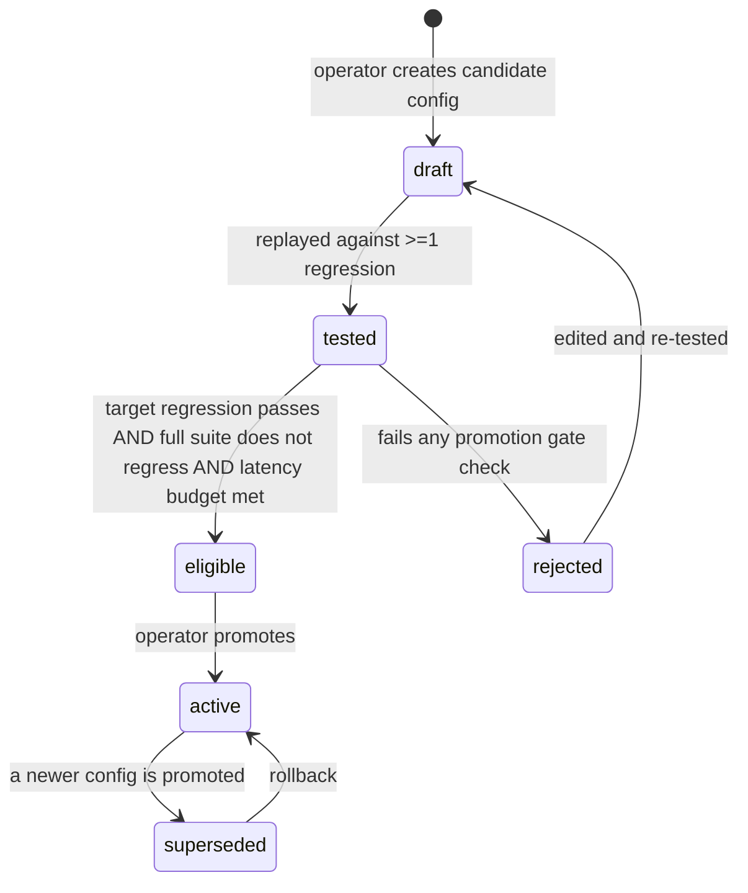

# Patchline — Implementation PRD

A self-healing reliability layer for production voice agents. The reference workload (an e-commerce support voice agent) exists only to generate realistic failures; the product is the supervisor that catches, blocks, repairs, and learns from them.

This document is the single source of truth for implementation. Read `DECISIONS.md` alongside it — every AssemblyAI/Groq field referenced here is verified against current docs, and `DECISIONS.md` explains every place this PRD had to translate the brief's language into a real API.

---

## 0. Product contract (brief Step 1)

| Field | Value |
|---|---|
| Project name | Patchline |
| Pitch | A self-healing reliability layer for production voice agents that blocks unsafe actions, repairs critical transcription errors live, and turns every recovered failure into a permanent regression test. |
| Demo domain | E-commerce customer support |
| Critical entity types | `order_id`, `tracking_id`, `customer_name`, `email`, `phone_number`, `shipping_address`, `product_sku`, `refund_amount`, `quantity`, `coupon_code` |
| Initial business tools | `lookup_order`, `lookup_customer`, `check_tracking`, `request_refund`, `update_shipping_address`, `lookup_product`, `create_support_case`, `escalate_to_human` |
| LLM | Groq, model `openai/gpt-oss-120b` (tool calling), used for both the Support Agent and the Reliability Supervisor's reasoning (repair-question generation, entity extraction fallback) |
| TTS | Groq Orpheus, model `canopylabs/orpheus-v1-english`, voice `autumn`, via `POST https://api.groq.com/openai/v1/audio/speech` (see `DECISIONS.md` D5) |
| STT | AssemblyAI Universal-Streaming, `wss://streaming.assemblyai.com/v3/ws` (see `DECISIONS.md` D1) |
| Hosting | Local-first pnpm monorepo; Next.js frontend (Vercel-deployable), one Fastify+ws backend process (Fly.io/Render-deployable) |
| Database | SQLite via Prisma |
| Operator auth | Single shared `OPERATOR_PASSWORD` → signed httpOnly session cookie (see `DECISIONS.md` D6) |

### Reversibility and risk classification

| Tool | Reversible? | Risk class | Why |
|---|---|---|---|
| `lookup_order` | yes (read-only) | low | No mutation. |
| `lookup_customer` | yes (read-only) | low | No mutation, but touches PII — gated on identity evidence. |
| `check_tracking` | yes (read-only) | low | No mutation. |
| `lookup_product` | yes (read-only) | low | No mutation. |
| `create_support_case` | yes (append-only log, closeable) | low | Worst case is a spurious case record. |
| `escalate_to_human` | yes (append-only) | low | Worst case is a spurious escalation; still gated so escalation reasons carry real evidence. |
| `update_shipping_address` | partially (old address recoverable from audit log, but a shipment may already be in flight) | high | Wrong address → misdelivered package. |
| `request_refund` | no (money movement; simulated/dry-run in this build, see below) | high | Wrong amount or wrong order → financial loss. |

`request_refund` and `update_shipping_address` execute in **dry-run mode** in this build (brief Step 2: "risky tools should support dry-run or simulated execution during the hackathon"): the tool computes and records the exact mutation it *would* perform, marks it `simulated: true` in the `tool_calls` row, and does not commit it to the `orders`/`customers` tables. This preserves the full gating/evidence/audit story without a real financial side effect.

### Evidence policy (source of truth for Action Gate — full detail in §7)

| Tool | Critical args | Evidence required to allow |
|---|---|---|
| `lookup_order` | `order_id` | `order_id` is `verified` (exists in commerce DB) |
| `lookup_customer` | `name` or `email_or_phone` | at least one identifier is `verified` |
| `check_tracking` | `tracking_id` | `verified` |
| `request_refund` | `order_id`, `amount` | `order_id` verified; `amount` is `verified` (matches order total/eligible amount) or `confirmed_by_caller`; caller identity (`email_or_phone` on the order) is `verified` |
| `update_shipping_address` | `order_id`, `address` | `order_id` verified; `address` is `confirmed_by_caller` (full address read back and confirmed) |
| `lookup_product` | `sku` | `verified` |
| `create_support_case` | `order_id` | `verified` or `ambiguous` (case creation is low-risk; ambiguous is allowed with a flag) |
| `escalate_to_human` | none critical | always allowed |

### One end-to-end demo scenario (written before implementation, per Step 1)

Caller: "I need the status of order BRK-71Q9." AssemblyAI mishears the final four characters as `7109`. Patchline extracts `order_id = BRK-7109`, validator finds no such order (but finds `BRK-71Q9` as a Levenshtein-close candidate), gate blocks `lookup_order`, supervisor asks "I heard B-R-K-7-1-0-9 — could you repeat the last four characters?", caller says "seven, one, Q, nine", supervisor reconstructs `BRK-71Q9`, re-validates (exists), gate allows, `lookup_order` executes, agent reports status. A `regressions` row is created from this exchange with `truth_source = caller_confirmation`. Operator replays the captured audio against a `keyterms_prompt`-boosted config in Regression Lab; it passes; operator promotes it; a second call with a similarly-shaped ID (`ZXA-4V8K`) succeeds first-pass under the promoted config. This scenario is Demo Call A/B/C in `DEMO.md`.

---

## 1. Architecture



### Ownership boundaries (module-level, all inside one backend process — see `DECISIONS.md` D6)

| Module | Owns | Does not own |
|---|---|---|
| **Realtime Gateway** | WebSocket lifecycle to the browser, session registry, routing audio in / transcript+audio out | AssemblyAI protocol details, LLM calls |
| **AssemblyAI Streaming Adapter** | AssemblyAI WS connection, query-param config, `UpdateConfiguration` on config change, translating `Turn`/`Begin`/`Termination`/`Heartbeat` into internal events | Entity semantics, business logic |
| **Conversation Orchestrator** | Turn-taking state machine, routing finalized turns to Support Agent and Reliability Supervisor, merging agent reply with supervisor repair questions | STT, TTS wire protocol |
| **Support Agent** | System prompt, tool schema exposure, calling Groq chat completions, proposing tool calls | Deciding whether a tool call is *allowed* — it only proposes |
| **Reliability Supervisor** | Coordinates Entity Extractor → Validators → Action Gate → Repair Engine → Regression Engine for every proposed tool call and every detected critical entity | Business tool execution |
| **Entity Extractor** | Typed extraction of critical entities from finalized turns (hybrid: regex/rule pass for structured IDs, Groq fallback for names/addresses), with provenance (utterance id, audio range) | Verification — extraction never marks something `verified` |
| **Independent Validators** | Deterministic checks against Commerce Sandbox (existence, format, checksum-like similarity) — never an LLM | Repair question wording |
| **Action Gate** | Evaluates a proposed tool call's args against the evidence policy table, returns `allow`/`block` + reason code | Executing the tool |
| **Repair Engine** | Generates the smallest targeted question for a blocked entity, applies caller's confirmation, re-triggers validation | Deciding pass/fail of a regression |
| **Regression Engine** | Creates `regressions` rows from recovered failures, orchestrates replay of stored audio against candidate configs, scores replay results, enforces promotion gate | Live-call gating |
| **Configuration Registry** | Stores/versions `configs`, tracks `active`, exposes the active config to the Adapter, records promotion/rollback audit events | Replay execution (Regression Engine calls back into the Adapter for that) |
| **Commerce Sandbox Service** | Seeded deterministic business data and typed tool functions | Voice/LLM concerns |
| **Event Store** | Append-only structured events for every module above | UI rendering (Dashboard reads via REST/WS, not by importing this module) |
| **Operator Dashboard** | Visualizing Event Store + Regression Lab + Configuration Registry state; issuing promote/rollback/replay commands | Any business logic — it never computes pass/fail itself, only displays what the backend computed |

---

## 2. State machines

### 2.1 Voice session lifecycle



### 2.2 Critical entity verification



`verified` and `confirmed_by_caller` are the only states from which a gated tool argument may be marked usable (see §7). `confirmed_by_caller` values are always re-validated once before use; if re-validation still fails, the entity is `escalated`, never silently forced through.

### 2.3 Tool-call gating



### 2.4 Repair flow



### 2.5 Regression lifecycle



### 2.6 Configuration lifecycle



---

## 3. Data model

All tables live in SQLite via Prisma. IDs are ULIDs (sortable, string) unless noted. Every table has `created_at`; mutable tables also have `updated_at`. Fields marked **immutable** are never updated after insert (append-only correction is a new row referencing the original, never an in-place edit) — this is what makes the Event Store and regression provenance trustworthy.

### `sessions`
| field | type | notes |
|---|---|---|
| id | string (PK) | **immutable** |
| started_at | datetime | **immutable** |
| ended_at | datetime? | |
| status | enum: `connecting,active,reconnecting,degraded,completed,failed` | |
| active_config_id | string (FK → configs.id) | config in effect at session start; a session can carry a different config than another concurrently |
| caller_label | string | synthetic, e.g. "Demo Caller 1" |
| summary | string? | filled at session end |
| mode | enum: `live_mic, prerecorded_clip` | Step 15 demo determinism |

### `utterances`
| field | type | notes |
|---|---|---|
| id | string (PK) | **immutable** |
| session_id | string (FK) | **immutable** |
| speaker | enum: `caller, agent` | **immutable** |
| text | string | **immutable** (AssemblyAI finals are immutable per turn; we store the turn's `transcript` once `end_of_turn=true`) |
| start_ms / end_ms | int | **immutable**, from AssemblyAI `words[].start/end` |
| turn_order | int | **immutable**, AssemblyAI `turn_order` |
| end_of_turn_confidence | float | **immutable** |

### `entities`
| field | type | notes |
|---|---|---|
| id | string (PK) | **immutable** |
| session_id / utterance_id | string (FK) | **immutable** |
| entity_type | enum (the 10 critical types) | **immutable** |
| raw_text | string | verbatim span from the utterance | **immutable** |
| normalized_value | string | post-normalization (e.g. spoken digits → `BRK-7109`) | **immutable** at extraction time |
| verification_state | enum: `unverified,validating,verified,ambiguous,rejected,confirmed_by_caller,escalated` | mutable — this is the one state-machine field allowed to change in place, all transitions logged to `audit_events` |
| verified_value | string? | set only on transition into `verified`/`confirmed_by_caller` |
| verified_by | enum: `deterministic_validation,caller_confirmation,human_review`? | matches §D8 provenance rule |
| start_ms / end_ms | int | **immutable**, audio range for this entity within the utterance |

### `validation_results`
| field | type | notes |
|---|---|---|
| id | string (PK) | |
| entity_id | string (FK) | |
| validator_name | string | e.g. `order_id_existence`, `order_id_similarity` |
| result | enum: `match,no_match,ambiguous_candidates` | |
| candidates | json? | for `ambiguous_candidates`: close-match order_ids with edit distance |
| ran_at | datetime | |

### `tool_calls` (covers both "proposed" and "executed" — see gate_result)
| field | type | notes |
|---|---|---|
| id | string (PK) | **immutable** |
| session_id | string (FK) | **immutable** |
| tool_name | string | **immutable** |
| proposed_args | json | **immutable**, exactly what the agent proposed |
| final_args | json? | set only if allowed — args actually executed (post-repair values) |
| gate_result | enum: `allowed,blocked` | |
| gate_reason | enum: `ENTITY_NOT_FOUND,ENTITY_AMBIGUOUS,MISSING_CONFIRMATION,VALUE_CONFLICT,LOW_EVIDENCE,POLICY_DENIED,null` | |
| simulated | boolean | true for `request_refund`/`update_shipping_address` (dry-run) |
| executed_at | datetime? | |

### `repair_events`
| field | type | notes |
|---|---|---|
| id | string (PK) | **immutable** |
| session_id / entity_id | string (FK) | **immutable** |
| question | string | **immutable** |
| response | string? | caller's transcribed reply |
| resolved_value | string? | |
| attempt_number | int | 1-based, capped at repair budget |
| turn_count | int | |
| latency_ms | int | question-asked → response-parsed |
| outcome | enum: `resolved,unresolved,escalated` | |

### `regressions`
| field | type | notes |
|---|---|---|
| id | string (PK) | **immutable** |
| source_session_id / entity_id | string (FK) | **immutable** |
| entity_type | enum | **immutable** |
| expected_value | string | **immutable** — see truth_source |
| observed_value | string | **immutable** — the original bad transcription |
| audio_asset | string | path under `/data/audio` | **immutable** |
| audio_start_ms / audio_end_ms | int | **immutable** — includes small context padding, not the whole call |
| context_before / context_after | string | **immutable**, surrounding transcript text |
| baseline_config_id | string (FK) | **immutable** — config active when the failure occurred |
| repair_method | enum: `caller_confirmation,deterministic_validation,human_review` | **immutable** — this IS `truth_source` |
| status | enum: `open,replaying,replayed,closed,reopened` | mutable |

### `configs`
| field | type | notes |
|---|---|---|
| id | string (PK) | **immutable** |
| version | int | **immutable**, monotonic |
| name | string | **immutable** |
| speech_model | enum: `universal-3-5-pro,universal-streaming-english` | **immutable** |
| context_mode | enum: `none,prompt,keyterms` | **immutable** — enforces D2 mutual exclusion |
| prompt | string? | **immutable**, ≤1750 chars, only if context_mode=prompt |
| keyterms_prompt | json (string[])? | **immutable**, ≤100 terms ≤50 chars, only if context_mode=keyterms |
| agent_context_enabled | boolean | **immutable** — whether the orchestrator feeds the agent's last reply into `agent_context` |
| previous_context_n_turns | int | **immutable**, 0–100 |
| end_of_turn_confidence_threshold | float | **immutable** |
| format_turns | boolean | **immutable** |
| notes | string | **immutable** |
| status | enum: `draft,tested,eligible,rejected,active,superseded` | mutable |
| promoted_by / promoted_at | string?/datetime? | |

### `replay_runs`
| field | type | notes |
|---|---|---|
| id | string (PK) | **immutable** |
| regression_id / config_id | string (FK) | **immutable** |
| transcript | string | **immutable** — replayed transcript |
| extracted_value | string | **immutable** |
| exact_match | boolean | **immutable** |
| normalized_match | boolean | **immutable** |
| latency_ms | int | **immutable** |
| transcript_delta | json | **immutable** — word-level diff vs. the regression's context, to catch side effects on nearby words |
| status | enum: `pass,fail` | **immutable** |
| ran_at | datetime | |

### `promotions`
| field | type | notes |
|---|---|---|
| id | string (PK) | **immutable** |
| config_id | string (FK) | **immutable** |
| action | enum: `promote,rollback` | **immutable** |
| previous_active_config_id | string? | **immutable** |
| suite_results | json | **immutable** — snapshot of every regression's pass/fail at promotion time |
| actor | string | **immutable** — operator identity |
| created_at | datetime | **immutable** |

### `audit_events`
| field | type | notes |
|---|---|---|
| id | string (PK) | **immutable** |
| event_type | string (see §8 event catalog) | **immutable** |
| actor | string | **immutable** — `system` or operator id |
| resource_type / resource_id | string | **immutable** |
| payload | json | **immutable** |
| correlation_id | string | **immutable** — session_id for live events, regression_id for replay events |
| created_at | datetime | **immutable** |

### Value lineage (how the five concepts stay distinct end to end)

`utterances.text` (raw transcript) → `entities.raw_text` (the span) → `entities.normalized_value` (deterministic normalization, e.g. NATO/digit-word parsing — still unverified) → `entities.verified_value` (only set once `verification_state ∈ {verified, confirmed_by_caller}`) → `tool_calls.final_args` (only what actually reached a business tool). Every arrow is a distinct field in a distinct row, never an overwrite, so a judge (or a test) can trace exactly which stage introduced or fixed an error.

---

## 4. Commerce sandbox (brief Step 2)

Seed dataset (fixture file `fixtures/commerce/seed.json`, loaded by `prisma db seed`):

**Customers**: 6 synthetic customers with name, email, phone, and 1–3 orders each. Includes one name with uncommon spelling (`Siobhan Mercer`) and one caller who will deliberately misstate their own email digit.

**Orders / order_ids** (intentionally confusable pairs, per brief Step 2):
- `BRK-71Q9` (real) vs. `BRK-7109` (does not exist — the O/0-style trap, here Q/1 confusion)
- `ZXA-4B8K` (real) vs `ZXA-4V8K` (does not exist — B/V confusion)
- `NV-15O2` (real) vs `NV-1502` (does not exist — O/0 confusion)

**Products/SKUs**: 10 SKUs including one pair differing by a single trailing character.

**Refund eligibility**: 2 orders eligible for full refund, 1 partial, 1 ineligible (past window) — used to test `request_refund`'s evidence policy against a real business rule, not just entity presence.

**Shipment statuses**: `processing, shipped, out_for_delivery, delivered, delayed`.

Typed tool functions (`services/commerce-sandbox/src/tools/*.ts`), each: validated input (zod), structured JSON output, and — for the two mutating tools — a `simulated` flag and an audit row. `lookup_order('BRK-7109')` returns `{ found: false, close_matches: [{ order_id: "BRK-71Q9", distance: 2 }] }` rather than a bare 404, because the Action Gate's `ENTITY_AMBIGUOUS` vs `ENTITY_NOT_FOUND` distinction depends on whether close matches exist.

**Completion checks**: tools importable and callable with no voice/LLM dependency; `pnpm --filter commerce-sandbox test` covers every seeded lookup (success) and every confusable pair (structured failure with correct reason).

---

## 5. Entity evidence layer (brief Step 4)

Extraction is a two-pass hybrid per finalized turn (`end_of_turn: true` `Turn` message):

1. **Rule pass** (deterministic, no LLM): regexes for structured formats (`order_id`, `tracking_id`, `product_sku`, `coupon_code`, `email`, `phone_number`) plus a spoken-digit/letter normalizer (handles "seven one Q nine" → `71Q9`, "B as in bravo" → `B`).
2. **LLM fallback pass** (Groq `openai/gpt-oss-120b`, JSON-mode tool call `extract_entities`): only for entity types the rule pass can't reliably regex (`customer_name`, `shipping_address`, `refund_amount` phrasing like "eighty dollars"), and only on turns where the rule pass found nothing but the Support Agent's intent classifier expects one of these types.

Every extracted entity is written to `entities` with `verification_state = unverified` immediately — extraction never sets `verified`. `source` is recorded as `rule` or `llm_fallback` on the `validation_results`-adjacent metadata so the dashboard can show which path produced it (useful for judging whether the LLM fallback is pulling weight or just noise).

---

## 6. Configuration schema (brief Steps 8–9, detailed)

```json
{
  "id": "cfg_ecommerce_v3",
  "version": 3,
  "name": "Keyterms + Agent Context",
  "speech_model": "universal-3-5-pro",
  "context_mode": "keyterms",
  "prompt": null,
  "keyterms_prompt": ["BRK", "ZXA", "NV", "SKU", "tracking number", "order ID"],
  "agent_context_enabled": true,
  "previous_context_n_turns": 5,
  "end_of_turn_confidence_threshold": 0.4,
  "format_turns": true,
  "notes": "Boosts commerce ID prefixes; feeds agent's last reply back as agent_context.",
  "status": "eligible"
}
```

Seeded initial configs (fixture `fixtures/configs/seed.json`):
- `cfg_baseline_v1`: `universal-streaming-english`, `context_mode: none`, `format_turns: false` — cheap, no domain help. This is the config active when the demo's known-failing clip was captured.
- `cfg_prompt_v2`: `universal-3-5-pro`, `context_mode: prompt`, prompt text describing the commerce ID format (`"Caller is reading an order ID in the format XXX-9999 where X is a letter and 9 is a letter-or-digit..."`).
- `cfg_keyterms_v3` (shown above): `universal-3-5-pro`, `context_mode: keyterms`, boosted with the exact confusable prefixes/suffixes from §4, `agent_context_enabled: true` — this is the candidate the demo promotes.

---

## 7. Policy engine / Action Gate (brief Step 5)

Evaluated synchronously before any tool call executes. Pseudocode contract:

```
evaluate(tool_call):
  for each critical_arg in policy[tool_call.tool_name].critical_args:
      entity = resolve_entity(tool_call, critical_arg)
      if entity.verification_state not in {verified, confirmed_by_caller}:
          return blocked(reason_code_for(entity))
  return allowed
```

`reason_code_for`:
- no entity extracted at all for a required arg → `LOW_EVIDENCE`
- `entities.verification_state == rejected` (validator found no match, no close candidates) → `ENTITY_NOT_FOUND`
- `verification_state == ambiguous` (close candidates exist) → `ENTITY_AMBIGUOUS`
- required caller confirmation missing (e.g. refund amount stated but not re-confirmed) → `MISSING_CONFIRMATION`
- two extracted values for the same slot disagree (e.g. caller stated two different order IDs) → `VALUE_CONFLICT`
- policy-level deny (e.g. `request_refund` attempted with unverified identity even though order_id is fine) → `POLICY_DENIED`

Blocking never mutates `tool_calls.proposed_args`; it writes the row with `gate_result=blocked`, `final_args=null`, and emits `action.blocked` (see §8) which the Repair Engine subscribes to.

---

## 8. Observability — event catalog and correlation

Every event type from the brief's Step 12 list is emitted to `audit_events` with `correlation_id = session_id` (live) or `= regression_id` (replay/promotion). Dashboard screens are pure reads over `audit_events` + the primary tables — no screen computes a metric the backend didn't already store.

`session.started, transcript.partial, transcript.final, entity.detected, entity.validation_started, entity.verified, entity.rejected, action.allowed, action.blocked, repair.started, repair.completed, regression.created, regression.replay_started, regression.replay_completed, config.promoted, config.rolled_back, session.completed`

WebSocket messages from backend → dashboard mirror this catalog 1:1 (`{ type: "entity.verified", payload: {...}, correlation_id }`) so a connected dashboard client never polls for state it should have received as a push.

### Core metrics (computed server-side, cached, exposed via `GET /api/metrics/overview`)
`critical_entity_accuracy, first_pass_entity_success_rate, repair_rate, repair_success_rate, mean_repair_turns, unsafe_action_prevention_count, regression_closure_rate, active_config_regression_score, p50_latency_ms, p95_latency_ms`. All computed from `entities`, `tool_calls`, `repair_events`, `regressions`, `replay_runs` — never hardcoded.

---

## 9. Build steps

Each step lists: Goal · Why · User-visible behavior · Backend work · Frontend work · Data model · APIs/events · External services · Env vars · Error cases · Tests · Manual verification · Artifacts · Definition of done · Open questions. Steps reference §3–§8 above instead of repeating schema text.

### Step 1 — Lock the product contract
Already executed above (§0). **Artifacts**: this PRD, `DECISIONS.md`. **DoD**: §0 table complete, one demo scenario written. **Open questions**: none — all brief blanks filled.

### Step 2 — Commerce sandbox
**Goal**: deterministic business backend the voice agent operates against. **Why**: every downstream mechanism (gating, repair, regression) needs a real source of truth to validate against. **User-visible behavior**: none yet (no voice layer) — but `pnpm --filter commerce-sandbox dev` exposes a local REST/RPC surface for manual `curl` testing. **Backend**: `services/commerce-sandbox` — Prisma schema for `customers, orders, products, tool_call_audit`; seed script; typed tool functions per §4. **Frontend**: none. **Data model**: `customers, orders, products` (sandbox-owned, distinct from the reliability tables in §3) + `tool_calls` audit writes. **APIs**: internal TS function exports, no HTTP yet (consumed in-process by the backend once Step 3 exists); add a thin `POST /internal/tools/:name` HTTP wrapper for direct manual testing. **External services**: none. **Env vars**: `DATABASE_URL`. **Error cases**: invalid SKU/order format → structured `{ found: false, reason: "INVALID_FORMAT" }`, never a throw. **Tests**: unit tests per tool (success, not-found, ambiguous-close-match, ineligible-refund). **Manual verification**: `curl localhost:PORT/internal/tools/lookup_order -d '{"order_id":"BRK-7109"}'` returns close-match structure. **Artifacts**: `fixtures/commerce/seed.json`, `services/commerce-sandbox/`. **DoD**: brief Step 2 completion checks all pass. **Open questions**: none.

### Step 3 — Live voice session
**Goal**: real-time voice conversation with AssemblyAI in the loop. **Why**: nothing else in the product exists without a live transcript stream with correlated audio. **User-visible behavior**: caller opens Call UI, grants mic permission, has a multi-turn conversation; partial transcript shown live, finals locked in per AssemblyAI's immutability guarantee. **Backend**: Realtime Gateway (`ws` server accepting browser audio), AssemblyAI Streaming Adapter (opens `wss://streaming.assemblyai.com/v3/ws?...`, per §D1/D3 query params from the session's active `configs` row, handles `Begin/Turn/SpeechStarted/Heartbeat/Termination`), audio persisted to a rolling buffer keyed by `session_id` (full raw audio kept only transiently in-memory/temp; only regression-relevant ranges are persisted long-term per §13/D6). **Frontend**: mic capture via `AudioWorklet` → PCM16 chunks (50–1000ms, per AssemblyAI limits) sent over the browser↔backend WS; live transcript panel. **Data model**: `sessions`, `utterances` (write on every `end_of_turn=true` Turn). **APIs/events**: browser↔backend WS protocol (`audio` binary frames, `{type:"partial"}`/`{type:"final"}` transcript frames back); `session.started`, `transcript.partial`, `transcript.final`, `session.completed` events. **External services**: AssemblyAI. **Env vars**: `ASSEMBLYAI_API_KEY` (server-side only; browser gets a short-lived `token` minted server-side via AssemblyAI's temporary-token mechanism — never the raw key). **Error cases**: AssemblyAI WS drop → session enters `reconnecting` (state machine §2.1), backend attempts reconnect with the same `active_config_id` within a grace window (10s), buffering outbound TTS; failure beyond grace → `degraded`, UI shows a visible banner, call continues in a "supervisor paused" mode rather than hard-failing. **Tests**: integration test with a mocked AssemblyAI WS server emitting scripted `Begin/Turn/Termination` sequences; asserts `utterances` rows match. **Manual verification**: speak into the mic, confirm partials update live and finals are stored with correct `start_ms/end_ms`. **Artifacts**: `services/backend/src/realtime/`, `apps/web/components/CallUI`. **DoD**: multi-turn call works, timestamps stored, session survives a simulated AssemblyAI reconnect. **Open questions**: none — token-minting flow confirmed as AssemblyAI's documented temporary-token mechanism.

### Step 4 — Entity evidence layer
**Goal**: typed, provenanced critical-entity extraction, per §5. **Why**: nothing can be gated or repaired without a typed entity with a verification state. **User-visible behavior**: dashboard's Session Detail begins showing entity markers on the transcript as they're detected (still `unverified`). **Backend**: rule-pass extractors (`packages/schemas` regex/normalizer library, unit-tested independently of the LLM), Groq fallback extractor (JSON tool-call mode) invoked only per §5's conditions. **Frontend**: entity markers rendered inline in transcript view (`Session Detail`, §11). **Data model**: `entities`. **APIs/events**: `entity.detected`. **External services**: Groq (fallback only). **Env vars**: `GROQ_API_KEY`. **Error cases**: Groq timeout on fallback pass → entity extraction for that slot is skipped for this turn (logged), not retried inline (would stall the call); the missing entity simply means the later gate blocks with `LOW_EVIDENCE`, which is the correct, safe behavior. **Tests**: unit tests for every regex/normalizer against the confusable-ID fixture set (§4); unit test asserting extraction never writes `verification_state != unverified`. **Manual verification**: speak a known confusable order ID, confirm `entities` row appears with correct `raw_text`/`normalized_value` and `unverified` state. **Artifacts**: `packages/schemas/entities.ts`, `services/backend/src/reliability/extraction/`. **DoD**: brief Step 4 completion checks pass. **Open questions**: none.

### Step 5 — Action gating
**Goal**: implement the Action Gate per §7. **Why**: this is the mechanism that actually prevents unsafe tool execution — the core safety claim of the product. **User-visible behavior**: a risky tool call the agent attempts is visibly blocked in Session Detail with a reason code before any business-system effect occurs. **Backend**: `services/backend/src/reliability/gate/` implementing §7's pseudocode against the policy table in §0; validators (`services/backend/src/reliability/validators/`) call Commerce Sandbox functions from Step 2, deterministic only (no LLM in this module, per ownership table). **Frontend**: blocked/allowed badge on tool-call events in Session Detail. **Data model**: `tool_calls`, `validation_results`. **APIs/events**: `entity.validation_started`, `entity.verified`, `entity.rejected`, `action.allowed`, `action.blocked`. **External services**: none (validators are deterministic against Commerce Sandbox). **Env vars**: none new. **Error cases**: Commerce Sandbox/DB unavailable during validation → gate fails closed (`POLICY_DENIED`, reason detail `VALIDATOR_UNAVAILABLE`), never fails open. **Tests**: integration test per tool: correct evidence → allowed; missing/ambiguous/conflicting evidence → blocked with the exact expected reason code (this is the test the brief explicitly calls out: "incorrect order ID must not reach `lookup_order`"). **Manual verification**: force a bad order ID through a live call, confirm `lookup_order` never executes and a `blocked` `tool_calls` row with `ENTITY_NOT_FOUND` appears. **Artifacts**: gate + validator modules. **DoD**: brief Step 5 completion checks pass. **Open questions**: none.

### Step 6 — Focused repair conversations
**Goal**: Repair Engine per §2.4. **Why**: blocking alone leaves the caller stuck; repair is what makes the block invisible-good rather than just annoying. **User-visible behavior**: caller hears a specific, narrow question ("I heard B-R-K-7-1-0-9 — could you repeat the last four characters?"), answers, call continues without restarting. **Backend**: `services/backend/src/reliability/repair/` — question templates keyed by `(entity_type, gate_reason)`, using the known-good prefix/context (never asking for information already confirmed), Groq used only to phrase ambiguous free-text cases (e.g. amount "eighty vs eighteen") where a template doesn't fit; repair budget = 2 attempts before `repair.completed(outcome=escalated)` triggers `escalate_to_human`. **Frontend**: repair Q&A shown as a distinct visual block in the Evidence Timeline (§11). **Data model**: `repair_events`; on resolution, updates the target `entities` row's `verification_state → confirmed_by_caller` then re-runs the Step 5 validator. **APIs/events**: `repair.started`, `repair.completed`. **External services**: Groq (phrasing fallback only), Groq Orpheus TTS to speak the question. **Env vars**: none new. **Error cases**: caller's response is itself unparseable → counts as `unresolved`, consumes a repair-budget attempt, re-asks more narrowly on attempt 2. **Tests**: integration test: blocked entity → repair question generated referencing the correct known-good prefix → simulated caller response → entity becomes `confirmed_by_caller` → gate re-evaluation now `allowed`. **Manual verification**: live call with a deliberately misspoken ID, confirm the repair question matches the template contract and the call recovers without reconnecting. **Artifacts**: repair module, question-template fixture file. **DoD**: brief Step 6 completion checks pass. **Open questions**: none.

### Step 7 — Automatic regression creation
**Goal**: Regression Engine's creation half, per §3 `regressions` schema and D8. **Why**: this converts a one-off recovery into a durable test asset — the brief's central "failure becomes a test" claim. **User-visible behavior**: after a successful repair, a new card appears in Regression Lab within the same session, with an audio clip attached. **Backend**: on `repair.completed(outcome=resolved)`, extract the audio range (`entities.start_ms/end_ms` padded by 1.5s context on each side) from the session's rolling audio buffer, persist it to `/data/audio/{regression_id}.wav`, write the `regressions` row with `repair_method` (= `truth_source`) set from how resolution happened — `caller_confirmation` for the Step 6 path; the deterministic-validation and human-review paths exist for entities that validate correctly without ever needing caller repair but are flagged for regression capture by an operator in Session Detail ("save as regression case"). **Frontend**: Regression Lab list view gets the new open card; Session Detail gets a "regression created" marker on the timeline. **Data model**: `regressions`. **APIs/events**: `regression.created`. **External services**: none. **Env vars**: `AUDIO_STORAGE_DIR`. **Error cases**: audio buffer for the needed range already evicted (buffer retention window exceeded) → regression creation fails closed with a logged `AUDIO_SEGMENT_MISSING` error, no regression row is silently created without its audio. **Tests**: integration test asserting a repair → regression round-trip produces a playable audio file with correct `audio_start_ms/end_ms` and correct `truth_source`. **Manual verification**: after a live repair, open Regression Lab, confirm the clip plays and the expected/observed values match what was spoken. **Artifacts**: regression-creation module. **DoD**: brief Step 7 completion checks pass. **Open questions**: none.

### Step 8 — Regression Lab (replay against candidate configs)
**Goal**: replay stored regression audio against multiple `configs`, score deterministically, per §6. **Why**: this is the mechanism that proves a fix generalizes, not just that one clip was patched by hand. **User-visible behavior**: operator opens a regression card, selects candidate configs (checkboxes), clicks "Replay"; a side-by-side result table appears (entity / latency / result) per the brief's example. **Backend**: Regression Engine's replay path opens a *new* AssemblyAI streaming session per (regression, config) pair, feeds the stored WAV at real-time pace (per AssemblyAI's documented pacing requirement for pre-recorded chunks) with the candidate config's query params, captures the resulting `Turn` transcript, extracts the entity via the Step 4 extractor, and scores: `exact_match` (byte-identical normalized value), `normalized_match` (case/format-insensitive), `latency_ms` (time to first relevant final), `transcript_delta` (word-diff against the regression's stored context, to catch collateral damage — e.g. keyterms boosting one ID but mangling a nearby word). **Frontend**: Regression Lab detail view — config picker, replay button, results table (Regression Compare component, §11), pass/fail badges. **Data model**: `replay_runs`. **APIs/events**: `regression.replay_started`, `regression.replay_completed`; `POST /api/regressions/:id/replay { config_ids: [] }`. **External services**: AssemblyAI (replay sessions), billed like any streaming session — noted in cost section of `SECURITY.md`/README. **Env vars**: none new. **Error cases**: replay session fails to connect → that candidate's row is `status: fail`, `latency_ms: null`, reason logged, other candidates in the batch still complete. **Tests**: integration test with a fixture WAV of one of the seeded confusable IDs, replayed against `cfg_baseline_v1` (expected fail) and `cfg_keyterms_v3` (expected pass) using AssemblyAI in a recorded/mocked mode for CI, plus one real-API smoke test gated behind an env flag for local/manual runs. **Manual verification**: replay the demo's captured failing clip against baseline and the keyterms candidate, confirm the table matches the brief's example shape (baseline FAIL, candidate PASS). **Artifacts**: replay module, Regression Lab UI. **DoD**: brief Step 8 completion checks pass. **Open questions**: none — replay-pacing and query-param mechanics confirmed against docs (§D1).

### Step 9 — Safe configuration promotion
**Goal**: promotion gate + versioning + rollback, per §2.6 and D7. **Why**: prevents a config that fixes one case from silently breaking others — the brief's explicit safety requirement. **User-visible behavior**: "Promote" button on a config only enables once it's `eligible`; promoting shows before/after regression-suite results; a "Rollback" button reverts to the previous active config instantly. **Backend**: promotion handler runs the *entire* open+closed regression suite (not just the target) against the candidate before allowing promotion; gate = (target passes) AND (no previously-passing regression flips to fail) AND (p95 latency across the suite ≤ 1.25× the active config's p95, a fixed threshold documented here rather than left implicit) ; writes `promotions` row (immutable snapshot of `suite_results`), flips `configs.status`. **Frontend**: Configuration Registry screen — active/previous, promotion history, rollback control, per-config regression score badge. **Data model**: `configs.status`, `promotions`. **APIs/events**: `config.promoted`, `config.rolled_back`; `POST /api/configs/:id/promote`, `POST /api/configs/:id/rollback`. **External services**: none beyond Step 8's replay calls. **Env vars**: `LATENCY_REGRESSION_THRESHOLD` (default `1.25`). **Error cases**: promotion attempted on a config that hasn't been replayed against the full suite → `422` with `POLICY_DENIED`-style error, UI disables the button rather than letting this be attempted. **Tests**: unit test of the promotion-gate function against fixture suite results (all-pass → eligible; one regression flips → rejected; latency over threshold → rejected); integration test of full promote→rollback round trip. **Manual verification**: promote the keyterms candidate from the demo scenario, confirm `promotions` row and `configs.active` flip, then roll back and confirm reversion. **Artifacts**: promotion module, Configuration Registry UI. **DoD**: brief Step 9 completion checks pass. **Open questions**: none.

### Step 10 — Close the learning loop live
**Goal**: prove a promoted config changes live behavior. **Why**: this is the strongest piece of demo proof in the brief. **User-visible behavior**: a new call (live or prerecorded-clip mode) using a similarly-shaped difficult ID succeeds first-pass, with the dashboard visibly using the newly active config. **Backend**: no new module — Realtime Gateway (Step 3) already reads `configs.active` at session start; this step is the integration point confirming that wiring plus adding a second confusable-ID demo clip (`ZXA-4V8K`) distinct from the one used to create the regression, so success isn't just "replaying the same audio." **Frontend**: Live Sessions screen shows "Config: cfg_keyterms_v3 (active)" on the new session; Reliability Overview's `first_pass_entity_success_rate` visibly ticks up. **Data model**: none new. **APIs/events**: none new — this step is verification, not construction. **External services**: AssemblyAI, live. **Env vars**: none new. **Error cases**: n/a (verification step); if the new call still fails, that's a real signal the candidate config is insufficient and should not have been promoted — this step doubles as an implicit extra regression check. **Tests**: end-to-end test scripted exactly as Demo Call C in `DEMO.md`. **Manual verification**: run Demo Call C live, confirm no repair turn is needed. **Artifacts**: none beyond the e2e test and demo script. **DoD**: brief Step 10 completion (`production failure -> repair -> regression -> candidate test -> promotion -> improved future call` all observed in one session of using the app). **Open questions**: none.

### Step 11 — Operator dashboard
**Goal**: the five required screens, per brief Step 11. **Why**: this is how a judge (or a real operator) experiences the product's reasoning, not just its outcome. **User-visible behavior**: navigable dashboard — Reliability Overview, Live Sessions, Session Detail, Regression Lab, Configurations. **Backend**: REST endpoints backing each screen (`GET /api/metrics/overview`, `GET /api/sessions`, `GET /api/sessions/:id`, `GET /api/regressions`, `GET /api/regressions/:id`, `GET /api/configs`) plus the dashboard WS subscription channel from §8. **Frontend**: `apps/web/app/(dashboard)/*` — Evidence Timeline component (§11 signature element) reused in Session Detail; Regression Compare table reused in Regression Lab. **Data model**: none new (read-only over existing tables). **APIs/events**: as listed; all dashboard state is a read of `audit_events` + primary tables per the brief's explicit requirement. **External services**: none. **Env vars**: none new. **Error cases**: WS subscription drop → dashboard falls back to polling `GET` endpoints every 3s until reconnect, shown as a small "reconnecting" indicator, never a blank screen. **Tests**: component tests for Evidence Timeline and Regression Compare against fixture event sequences; API route tests for each endpoint. **Manual verification**: walk all 5 screens during a live demo call and confirm every visible number matches a corresponding stored row. **Artifacts**: dashboard app. **DoD**: brief Step 11's five screens all present and driven by real data. **Open questions**: none.

### Step 12 — Observability and evidence
Largely delivered incrementally in Steps 3–11 (every step already specifies its events). This step is the audit pass: **Goal**: confirm full event catalog coverage and correlation-id consistency. **Backend**: a coverage test iterating the brief's Step 12 event list and asserting each has at least one emission site in the codebase; a lint rule / code-review checklist item requiring new state transitions to emit an event. **Tests**: the coverage test itself, run in CI. **Manual verification**: pick 3 random events in `audit_events` from a demo run and confirm each is explained by a real dashboard-visible action. **Artifacts**: `tests/integration/event_coverage.test.ts`. **DoD**: brief Step 12 completion. **Open questions**: none.

### Step 13 — Privacy and security controls
**Goal**: implement the controls listed in brief Step 13 and `SECURITY.md`. **Backend**: `OPERATOR_PASSWORD` → signed cookie auth middleware on all `/api/*` and dashboard WS routes; configurable audio retention (`AUDIO_RETENTION_DAYS`, default 30, cron-style cleanup job removing regression clips past that window — clips referenced by an un-closed regression are exempt); PII redaction toggle for `customer_name`/`email`/`phone_number` fields when rendered in non-operator contexts (not applicable to a single-operator hackathon build, implemented as a documented no-op flag `REDACT_TRANSCRIPT_PII` for future multi-tenant use, explicitly not claimed as active in this build unless enabled); TLS is handled by the hosting platform (Vercel/Fly.io terminate TLS) — documented, not re-implemented. **Data model**: none new. **Env vars**: `OPERATOR_PASSWORD`, `SESSION_SECRET`, `AUDIO_RETENTION_DAYS`. **Error cases**: missing `OPERATOR_PASSWORD` at boot → server refuses to start in non-dev mode (fail closed, no default password shipped). **Tests**: auth middleware unit tests (valid/invalid/missing cookie); retention-cleanup unit test with fixture clock. **Manual verification**: confirm dashboard is unreachable without login; confirm `.env` is gitignored and `.env.example` has no real values. **Artifacts**: auth middleware, retention job. **DoD**: brief Step 13 completion checks pass; full detail in `SECURITY.md`. **Open questions**: none.

### Step 14 — Adversarial tests
**Goal**: the speech reliability benchmark from brief Step 14. **Backend/fixtures**: `fixtures/audio/adversarial/` — a labeled set of short prerecorded clips (recorded via TTS-generated synthetic speech for reproducibility, since real accented/noisy human recordings aren't guaranteed reproducible) covering: fast speech, background noise (synthetically mixed), spelling correction mid-utterance, `O`/`0`, `B`/`V` confusion, repeated values, interruption/barge-in, caller changing their mind mid-entity, entity spoken twice with different values (VALUE_CONFLICT), uncommon name spelling, `18`/`80` amount ambiguity. Each fixture has a manifest entry: `{clip, entity_type, expected_value, expected_gate_reason_if_any, expected_tool_called}`. **Tests**: `tests/regression/adversarial.test.ts` runs every fixture through the full pipeline (extraction → gate → repair-if-needed) and asserts the *business outcome* per fixture's manifest — correct tool called, incorrect tool blocked, repair question targeted (string-matches expected template), confirmed value replaces unverified value, regression artifact created where expected. **Manual verification**: spot-check 3 fixtures live by playing the clip into the mic. **Artifacts**: adversarial fixture set + test suite. **DoD**: brief Step 14 completion — all listed adversarial categories represented and tested for business outcome, not just transcript text. **Open questions**: exact TTS voice/noise-mixing parameters for fixture generation are left to the implementer; any reasonable synthetic method satisfies this step as long as fixtures are labeled and reproducible.

### Step 15 — Deterministic judge demo
**Goal**: demo mode per brief Step 15. **Backend**: `mode: prerecorded_clip` sessions (§3 `sessions.mode`) stream a WAV file through the same Adapter code path as live mic input (byte-identical pipeline, only the audio source differs) at real-time pace; a `POST /api/demo/reset` endpoint restores the seeded DB + seeded baseline config + removes any regressions/promotions created during a previous demo run, restoring exactly the state described in §0's demo scenario. **Frontend**: "Reset Demo" control in the dashboard; a clip picker in Call UI (`Live Mic` / `Demo Clip: BRK-71Q9 (known failure)` / `Demo Clip: ZXA-4V8K (post-fix)`). **Data model**: none new. **APIs/events**: `POST /api/demo/reset`. **External services**: none beyond normal AssemblyAI usage. **Env vars**: none new. **Error cases**: reset called mid-active-session → active sessions are force-completed first. **Tests**: e2e test running the full three-call script (Demo Call A/B/C) end to end against demo-clip mode, asserting the same outcomes as Step 10's live version. **Manual verification**: run `DEMO.md`'s script twice in a row, confirming identical outcomes both times after a reset. **Artifacts**: demo-clip fixtures, reset endpoint, `DEMO.md`. **DoD**: brief Step 15 and Acceptance Criteria (§10 below) all satisfied via demo-clip mode without depending on live mic conditions.

---

## 10. Acceptance criteria (brief §19, restated as the implementation's Definition of Done)

- [ ] Real voice session streams through AssemblyAI Universal-Streaming.
- [ ] Support Agent calls deterministic Commerce Sandbox tools.
- [ ] Critical entities stored with audio provenance (`entities.start_ms/end_ms` + `utterance_id`).
- [ ] An invalid critical value blocks a tool action (`tool_calls.gate_result=blocked`).
- [ ] Supervisor asks a targeted repair question.
- [ ] Caller confirmation resolves the entity (`confirmed_by_caller`).
- [ ] Original workflow resumes without reconnect.
- [ ] Regression case created from the recovered failure, with correct `truth_source`.
- [ ] Captured audio replayable.
- [ ] ≥2 configs compared side-by-side with deterministic pass/fail.
- [ ] Candidate config promotable, versioned, with suite-regression check.
- [ ] Later call uses the promoted config and succeeds first-pass.
- [ ] Dashboard reflects real stored events end to end.
- [ ] Full reliability loop covered by tests (unit/integration/e2e/adversarial).
- [ ] Repo reproducible from documented bootstrap (`README.md`).
- [ ] Demo works in `prerecorded_clip` mode independent of live mic conditions.

---

## 11. UI specification

Five screens (brief Step 11), implemented as described per-step in §9. Signature components:

**Evidence Timeline** (Session Detail) — chronological list, one row per `audit_events` row for that `correlation_id=session_id`, rendered as:
```
00:18.2  Caller speaks order ID
00:19.4  Entity detected: BRK-7109
00:19.6  Validation failed
00:19.7  lookup_order blocked
00:20.1  Repair question spoken
00:23.2  Caller confirms "71Q9"
00:23.5  Entity verified: BRK-71Q9
00:23.7  lookup_order allowed
00:24.0  Regression #018 created
```
Each row links to the exact audio range via an inline waveform scrubber.

**Regression Compare** (Regression Lab) — table of `replay_runs` for the selected regression, one row per config:
```
                     ENTITY       LATENCY       RESULT
Baseline             BRK-7109     412 ms        FAIL
Context v2           BRK-71Q9     438 ms        PASS
Keyterms v3           BRK-71Q9     421 ms        PASS
```
with a Promote button appearing next to any `PASS` row whose config is `eligible`.

Design language: developer/reliability tooling (dense tables, monospace for IDs/timestamps, status badges, dark-mode-friendly), not a consumer chat UI.
